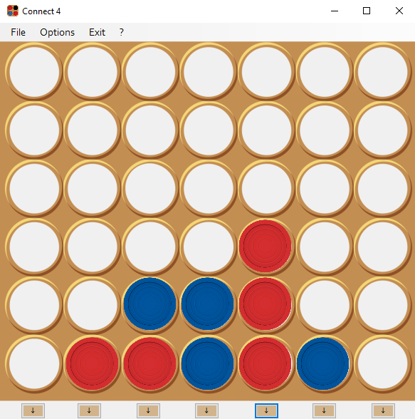
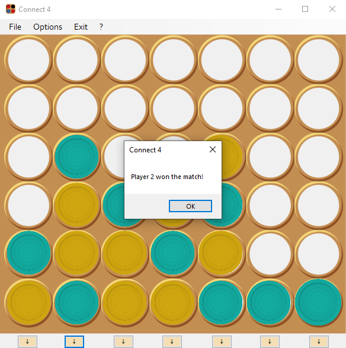

# Windows Forms Connect 4

This is the replica of the classic "Connect Four" board game, made with Windows Forms using the C# language.

The project was developed by a little group of 16-17 y/o students during and extracurricular school course in Italy.

Screenshot 1               |  Screenshot 2
:-------------------------:|:-------------------------:
       |  

## License

The source code of this project is licensed under the [MIT License](https://choosealicense.com/licenses/mit/).